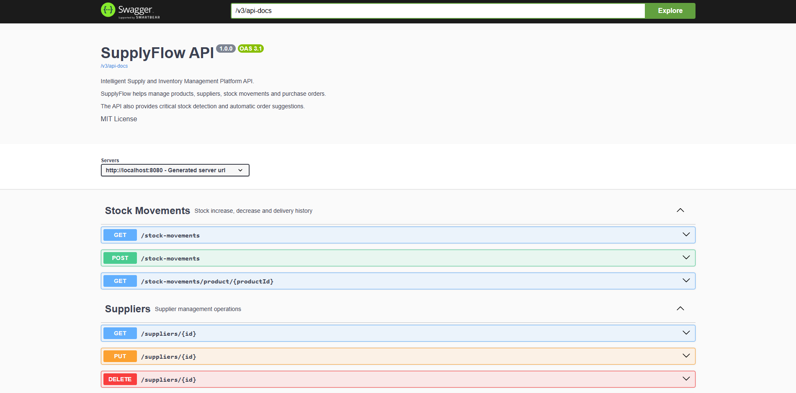
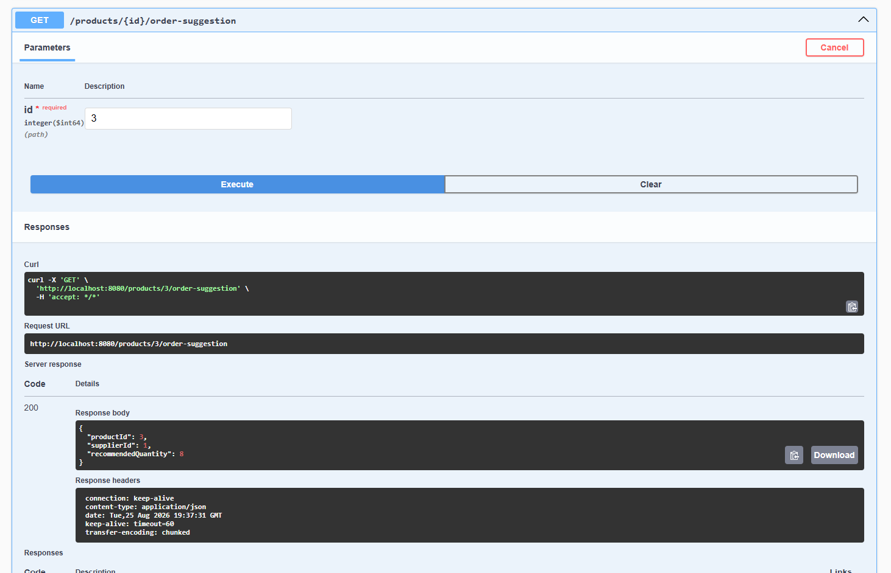
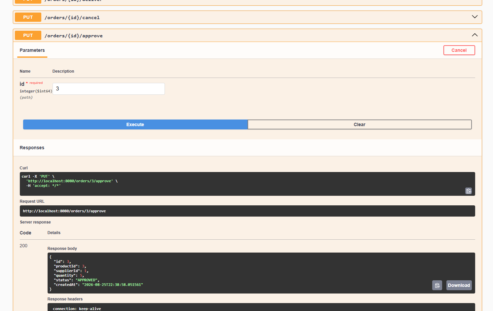
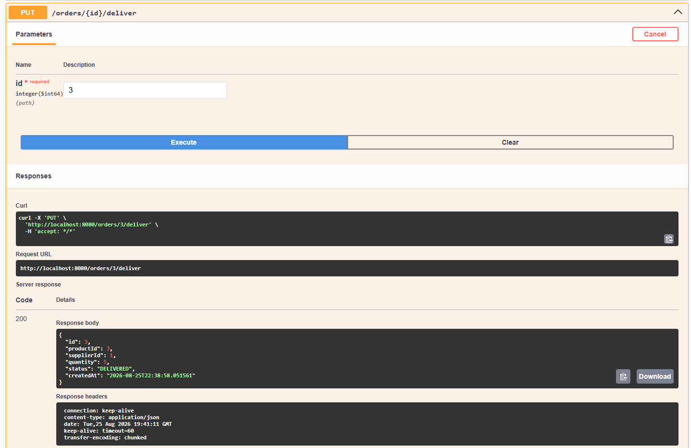
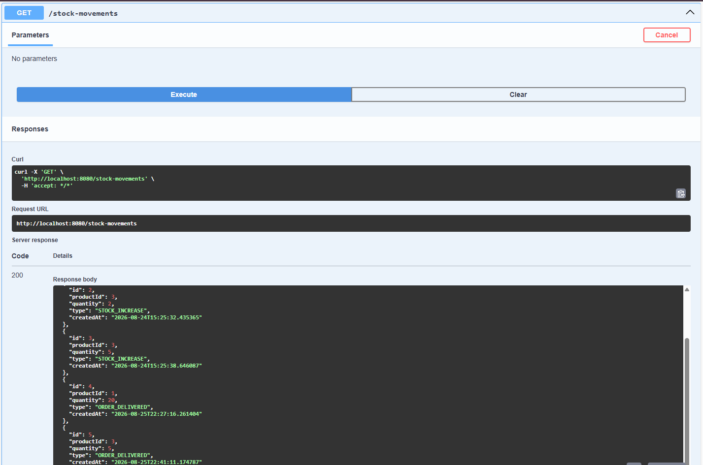
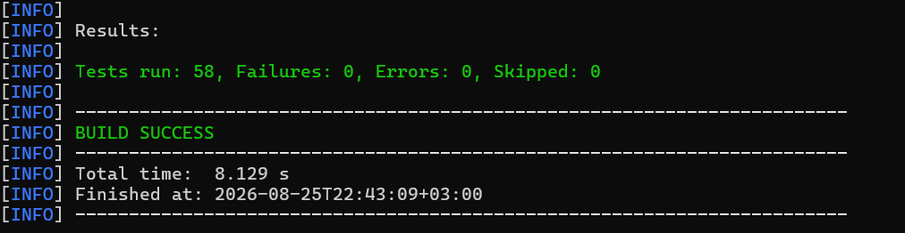

# 🚀 SupplyFlow

## Intelligent Supply & Inventory Management Platform

SupplyFlow is a backend application designed to manage products, suppliers, inventory, stock movements, and purchase orders.

The system goes beyond basic CRUD operations by providing business logic for:

- Critical stock detection
- Automatic order suggestions
- Purchase order lifecycle management
- Automatic stock updates after order delivery
- Stock movement history tracking

---

## 📸 API Overview

SupplyFlow provides a RESTful API documented with Swagger / OpenAPI.

The API is organized into four main areas:

- Products
- Suppliers
- Orders
- Stock Movements



---

## ✨ Features

### 📦 Product Management

- Create products
- Update products
- Delete products
- Retrieve products
- Increase product stock
- Decrease product stock
- Detect critical stock levels

#### Example endpoints

```text
GET    /products
GET    /products/{id}
POST   /products
PUT    /products/{id}
DELETE /products/{id}
PATCH  /products/{id}/increase-stock
PATCH  /products/{id}/decrease-stock
GET    /products/critical
```

---

### 🚨 Critical Stock Detection

Products are automatically marked as critical when their stock quantity reaches or falls below the configured minimum stock level.

```text
stockQuantity <= minimumStockLevel
```

Critical products can be retrieved using:

```text
GET /products/critical
```

---

### 🤖 Automatic Order Suggestions

SupplyFlow can generate purchase order suggestions for products with critical stock levels.

The system determines:

- Which product requires restocking
- Which supplier provides the product
- The recommended order quantity

Example response:

```json
{
  "productId": 3,
  "supplierId": 1,
  "recommendedQuantity": 8
}
```

Endpoints:

```text
GET /products/{id}/order-suggestion
GET /products/order-suggestions
```



---

### 🏢 Supplier Management

Suppliers can be created, updated, retrieved, and deleted.

```text
GET    /suppliers
GET    /suppliers/{id}
POST   /suppliers
PUT    /suppliers/{id}
DELETE /suppliers/{id}
```

---

### 📑 Purchase Order Management

SupplyFlow supports a complete purchase order lifecycle.

```text
CREATED
   ↓
APPROVED
   ↓
DELIVERED
```

Orders can also be cancelled when appropriate.

Available operations:

```text
POST /orders
PUT  /orders/{id}/approve
PUT  /orders/{id}/deliver
PUT  /orders/{id}/cancel
```

When an order is delivered:

- The order status becomes `DELIVERED`
- Product stock is automatically increased
- A stock movement with type `ORDER_DELIVERED` is created





---

### 📊 Automatic Stock Movement Tracking

Every stock operation can be recorded as a stock movement.

Supported movement types:

- `STOCK_INCREASE`
- `STOCK_DECREASE`
- `ORDER_DELIVERED`

Stock movement history can be retrieved using:

```text
GET /stock-movements
GET /stock-movements/product/{productId}
```

Example:

```json
{
  "productId": 3,
  "quantity": 5,
  "type": "ORDER_DELIVERED"
}
```



---

## 🧠 Business Rules

SupplyFlow includes several business validations.

### Product and Supplier Validation

An order cannot be created if:

- The product does not exist
- The supplier does not exist
- The selected supplier does not supply the selected product
- The quantity is less than or equal to zero

### Order Lifecycle Validation

Orders follow a controlled lifecycle.

```text
CREATED → APPROVED → DELIVERED
```

Invalid state transitions are prevented by the business logic.

### Duplicate Order Prevention

When automatically creating orders for critical products, the system checks whether an open order already exists.

Open order statuses:

- `CREATED`
- `APPROVED`

This prevents duplicate purchase orders for the same product.

---

## 🏗 Architecture

The application follows a layered architecture.

```text
                ┌───────────────┐
                │  Controller   │
                │   REST API    │
                └───────┬───────┘
                        │
                        ▼
                ┌───────────────┐
                │    Service    │
                │ Business Logic│
                └───────┬───────┘
                        │
                        ▼
                ┌───────────────┐
                │  Repository   │
                │ Spring Data   │
                └───────┬───────┘
                        │
                        ▼
                ┌───────────────┐
                │ PostgreSQL DB │
                └───────────────┘
```

The project also includes:

- DTO Layer
- Validation
- Global Exception Handling
- Unit Tests
- Controller Tests
- Swagger Documentation

---

## 🛠 Technologies

| Technology | Usage |
|---|---|
| Java 21 | Programming Language |
| Spring Boot 3.5 | Application Framework |
| Spring Web | REST API |
| Spring Data JPA | Data Persistence |
| PostgreSQL | Database |
| Maven | Dependency Management |
| JUnit 5 | Testing |
| Mockito | Unit Testing |
| MockMvc | Controller Testing |
| Jakarta Validation | Request Validation |
| Swagger / OpenAPI | API Documentation |

---

## 📂 Project Structure

```text
src
│
├── main
│   └── java
│       └── com.supplyflow
│
│           ├── controller
│           ├── service
│           ├── repository
│           ├── model
│           ├── dto
│           └── exception
│
└── test
    └── java
        └── com.supplyflow
```

---

## 🔗 API Endpoints

### Products

| Method | Endpoint | Description |
|---|---|---|
| GET | /products | Get all products |
| GET | /products/{id} | Get product by ID |
| POST | /products | Create product |
| PUT | /products/{id} | Update product |
| DELETE | /products/{id} | Delete product |
| PATCH | /products/{id}/increase-stock | Increase stock |
| PATCH | /products/{id}/decrease-stock | Decrease stock |
| GET | /products/critical | Get critical stock products |
| GET | /products/{id}/order-suggestion | Get order suggestion |
| GET | /products/order-suggestions | Get all order suggestions |

### Suppliers

| Method | Endpoint | Description |
|---|---|---|
| GET | /suppliers | Get all suppliers |
| GET | /suppliers/{id} | Get supplier by ID |
| POST | /suppliers | Create supplier |
| PUT | /suppliers/{id} | Update supplier |
| DELETE | /suppliers/{id} | Delete supplier |

### Orders

| Method | Endpoint | Description |
|---|---|---|
| GET | /orders | Get all orders |
| GET | /orders/{id} | Get order by ID |
| POST | /orders | Create order |
| POST | /orders/from-suggestion | Create order from suggestion |
| POST | /orders/critical-products | Create orders for critical products |
| PUT | /orders/{id}/approve | Approve order |
| PUT | /orders/{id}/deliver | Deliver order |
| PUT | /orders/{id}/cancel | Cancel order |

### Stock Movements

| Method | Endpoint | Description |
|---|---|---|
| GET | /stock-movements | Get all stock movements |
| POST | /stock-movements | Create stock movement |
| GET | /stock-movements/product/{productId} | Get movements by product |

---

## 🗄 Database Setup

Create a PostgreSQL database:

```sql
CREATE DATABASE supplyflow_db;
```

Configure your database connection in:

```text
src/main/resources/application.properties
```

Example:

```properties
spring.datasource.url=jdbc:postgresql://localhost:5432/supplyflow_db
spring.datasource.username=postgres
spring.datasource.password=YOUR_PASSWORD

spring.jpa.hibernate.ddl-auto=update

spring.jpa.show-sql=true
spring.jpa.properties.hibernate.format_sql=true
```

⚠️ Do not commit your real database password to GitHub.

---

## ▶️ Running the Application

Clone the repository:

```bash
git clone https://github.com/YOUR_USERNAME/supplyflow.git
```

Navigate to the project:

```bash
cd supplyflow
```

Run the application:

```bash
mvn spring-boot:run
```

The application will start at:

```text
http://localhost:8080
```

---

## 📖 API Documentation

Swagger UI is available at:

```text
http://localhost:8080/swagger-ui/index.html
```

OpenAPI documentation:

```text
http://localhost:8080/v3/api-docs
```

---

## 🧪 Testing

The project includes unit tests and controller tests.

Run all tests:

```bash
mvn clean test
```

Current test results:

```text
Tests run: 58
Failures: 0
Errors: 0
Skipped: 0

BUILD SUCCESS
```



---

## 🚀 Future Improvements

Possible future improvements include:

- Spring Security
- JWT Authentication
- Role-based authorization
- Pagination and filtering
- Docker support
- Docker Compose
- CI/CD pipeline
- API versioning
- Logging and monitoring
- Integration tests
- Deployment to a cloud platform

---

## 👩‍💻 Author

**Simay Ayanoğlu**
Backend Developer

---

## 📄 License

This project is licensed under the MIT License.